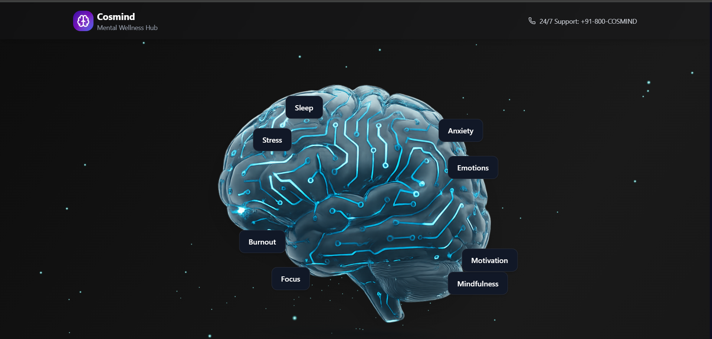
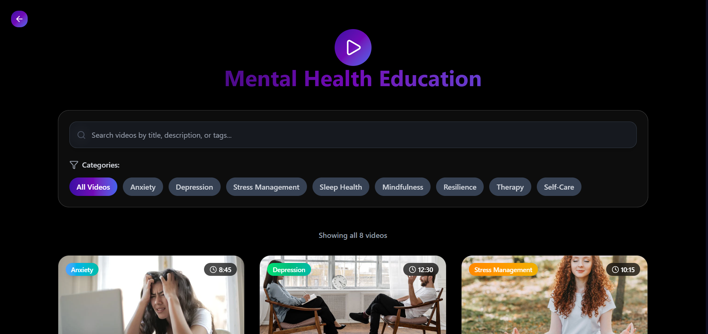
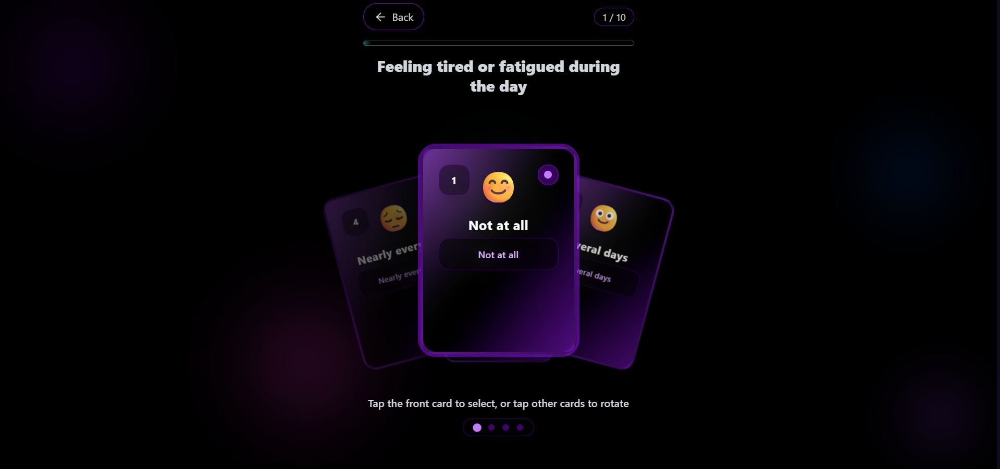
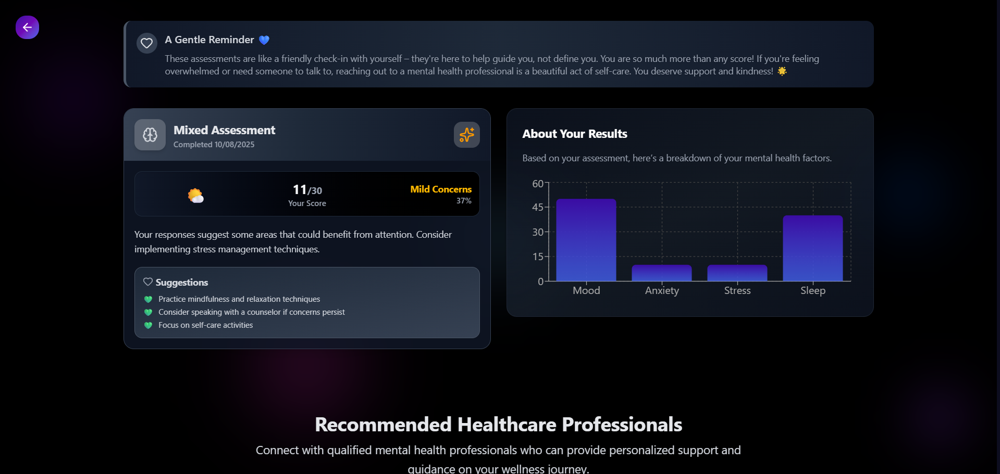
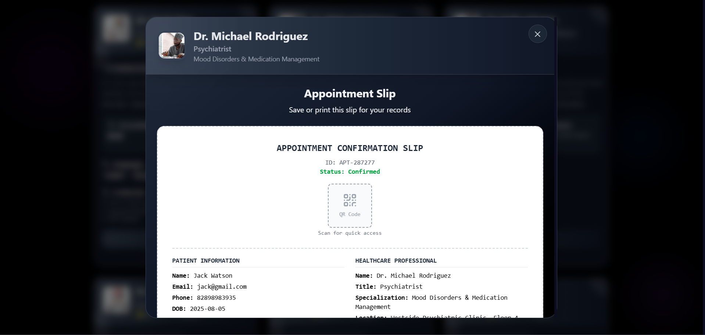
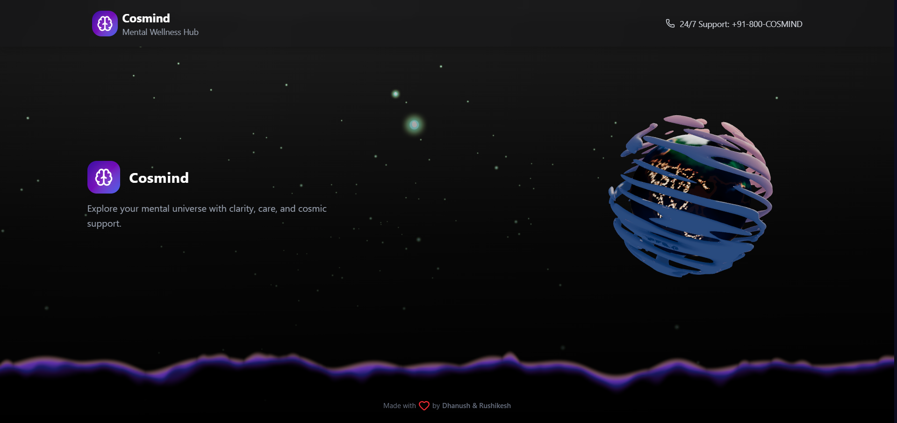

<h1 align="center">Cosmind</h1> 

  <p align="center"><em>Cosmind is like having a friendly co-pilot for your brain — here to help you pause, breathe, and check in with yourself.  
Think of it as a cosmic coffee break: you explore your mind, learn a few things, and maybe even feel lighter than a spacewalking astronaut.  
It’s part science, part self-care, and 100% more fun than filling out a boring paper questionnaire.🧠💫</em></p>

---
### 🚀 What Makes PIXEL Awesome
- **Fun Checkups** — No boring forms. Just a space mission for your brain.   
- **Clicky Quiz** — Science-backed questions with a circular selector you’ll want to spin twice.   
- **Watch & Learn** — Mental health videos you’ll actually finish (and maybe send to a friend).  
- **Book & Go** — Book a doc, print a receipt, walk in like an astronaut on a mission.   

---
> If our site makes your brain feel lighter than zero-gravity, mission accomplished. 🚀💫


## 🖼️ Screenshots & Visual Tour

Take a quick tour through the key screens of **Cosmind** — see how the experience flows from loading to results!

<div align="center">

| **Loader Page** | **Main Page** | **Video Page** |
|:---------------:|:-------------:|:--------------:|
|  |  |  |

| **Quiz Page** | **Result Page** | **Slip Page** |
|:-------------:|:---------------:|:-------------:|
|  |  |  |

| **Footer Page** |
|:---------------:|
|  |

</div>

---

<p align="center" style="max-width: 600px; margin: auto; font-style: italic; color: #888;">
Each screenshot showcases a major feature or flow, designed with your mental wellness journey in mind — from the playful loading screen to personalized results.
</p>


---
## 🧰 Tech Stack

| Technology       | Description                            |
|------------------|----------------------------------------|
| ⚛️ React.js       | JavaScript library for building UI      |
| 🎨 Tailwind CSS   | Utility-first CSS framework             |
| 🧩 Lucide Icons   | Beautiful & consistent icons            |
| 🎬 CSS Animations | Smooth loader, hover & scrolling effects |
| 🌐 React Three Fiber | 3D rendering with WebGL and Three.js |
| 🌀 Drei           | Helpers for React Three Fiber |

---
## 🛠️ Installation & Setup

To run the project locally:

```bash
# 1. Clone the Repository
git clone https://github.com/DhanushNadar/Cosmind

cd Cosmind

# 2. Install Dependencies
npm install

# 3. Start Development Server
npm run dev
```

---
<p align="center">
  
</p>

<p align="center">
  You’ve reached the end of the README.<br>
  <b>If you read this far, congratulations — you’ve escaped the black hole of procrastination. 🕳️🚀</b><br>
  <em>(Don’t worry, our mental health tips have a stronger pull than gravity.)</em>
</p>
